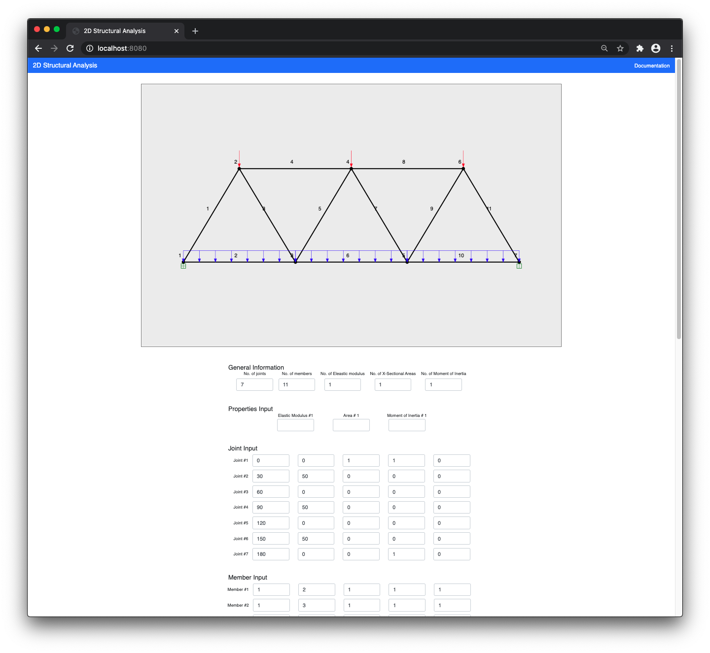
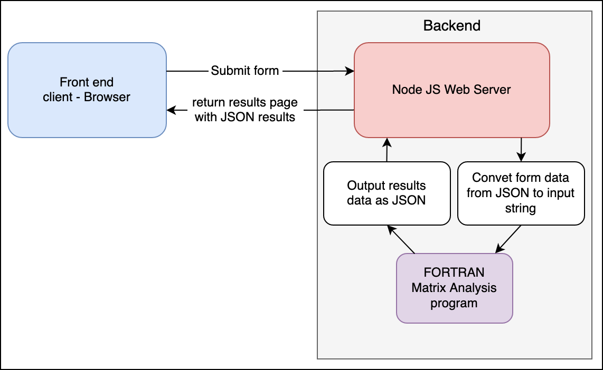

# Structural-analysis-program

A 2-dimensional structural frame analysis program written in FORTRAN95.

This repo is a continuation of [structural analysis](https://github.com/FredLavoie/structural-analysis) which was written using plain html with a temptlating engine, no front end
libraries or frameworks and no database.

### The story

The FORTRAN program was built while in university for a course called Structural Analysis II. It required the user to write out the information in an input text file, execute the
program which would create an output text file for the user with all the result information.

My intention was to create a web-based user interface for the FORTRAN program. As the user enters the information for the structure, a 2D visual representation is drawn in real
time of the structure. Upon submitting the form, the server executes the FORTRAN program executable with the submitted form data. The FORTRAN program outputs the results in a JSON
format which the server then returns to the front end client. Finally, the client then displays the results visually to the user.

## Screenshot

### Structure input form

The input form is where the user input the coordinates of the joints, the members, the supports and the loads that are applied to the structure.

### Data Flow

### Tech Stack

-   [Typescript](https://www.typescriptlang.org/)

Front end:

-   [React 18](https://reactjs.org/)
-   [Bootstrap](https://getbootstrap.com/)
-   [Vite](https://vitejs.dev/)

Back end:

-   [Node JS 16](https://nodejs.org/en/)
-   [Express JS](https://expressjs.com/)
-   [Prisma](https://www.prisma.io/)
-   [Mongo](https://www.mongodb.com/)
-   [Docker](https://www.docker.com/)
-   [FORTRAN 95](https://fortran-lang.org/en/)
